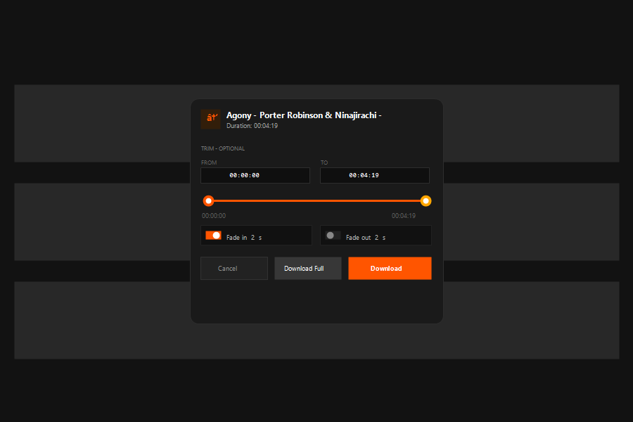

# SoundCloud Downloader

Chrome/Brave extension for downloading SoundCloud tracks as 128k MP3 — with trim, fade, and correct ID3 tags. Manifest V3.



## Quick Install

### Option 1: Release ZIP / CRX (recommended)

1. Download [`soundcloud-dl-v1.1.5.zip`](https://github.com/GeoXTen/soundcloud-dl/releases/latest/download/soundcloud-dl-v1.1.5.zip) or [`soundcloud-dl-v1.1.5.crx`](https://github.com/GeoXTen/soundcloud-dl/releases/latest/download/soundcloud-dl-v1.1.5.crx) from [Releases](https://github.com/GeoXTen/soundcloud-dl/releases/latest)
2. For ZIP: extract anywhere → open `chrome://extensions` (or `brave://extensions`) → **Developer mode** ON → **Load unpacked** → select folder
3. For CRX: drag `crx` onto `chrome://extensions` with Developer mode ON
4. Visit any SoundCloud page and click the orange download button

### Option 2: Clone repo

```bash
git clone https://github.com/GeoXTen/soundcloud-dl.git
```

Then `chrome://extensions` → Developer mode → Load unpacked → select `soundcloud-dl` folder.

## Features

- **Download any track** as 128k MP3 (SoundCloud's max for free/public API)
- **Works everywhere** — track pages, feed, likes, playlists, search, discover
- **Correct filenames** — `Artist - Title.mp3` (not server UUIDs)
- **Trim** — optional `FROM`/`TO` (00:00:00) with draggable slider (CBR byte-slice, 26ms accurate, no re-encode)
- **Fade in / Fade out** — flat toggles, duration `0.5–10s` (default 2s), Web Audio + lamejs re-encode; validated `fadeIn+fadeOut < duration`
- **ID3v2.3 tags** — TIT2/TPE1/TALB/TDRC/TCON/TRCK/COMM/APIC with artwork `t500x500`, stripping existing ID3v1/v2
- **SPA-aware** — detects playing track from player bar (both old light + new 2026 dark UI)
- **Flat UI** — no spring bounce: `#ff5500` feed btn, 30px player circle, `#111` cards, `0.15s` color only

## How it works

1. Extracts `client_id` from page scripts (`a-v2.sndcdn.com`)
2. Resolves track URL via player bar / meta tags → `api-v2/resolve?url=…`
3. Fetches `api-v2/tracks/{id}` → picks `mp3_0_1` progressive transcoding
4. If `download_url` present (uploader enabled download) uses original; else streams 128k
5. Strips old ID3, builds new ID3v2.3 (synchsafe header, UTF-16 BOM, dual 00 terminators for COMM)
6. Trim/fade: byte-slice for plain trim, lamejs CBR 128k re-encode for fade

## Supported browsers

- Chrome 88+, Brave, Edge 88+, any Chromium MV3

## Notes

- SoundCloud caps the public API at **128k MP3 CBR**. 256k AAC HLS requires login + Go+ and is not included (kept free-only).
- Some tracks may be geo- or download-restricted by the artist.
- Extension ID is keyed via `key.pem` (not in repo, `*.pem` gitignored).

## Changelog

- **v1.1.5** (2026-09-03): new flaticon icon, flat fade toggles (30×18), grid cards (no wrap), grey dot centering fix, CRX release
- **v1.1.0 – v1.1.4**: CBR trim, ID3 fixes, heartbeat removal, duplicate-btn fix, toast/popup flat redesign

## License

MIT — see repo.
